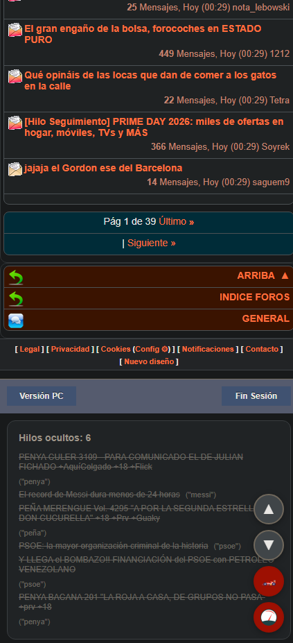
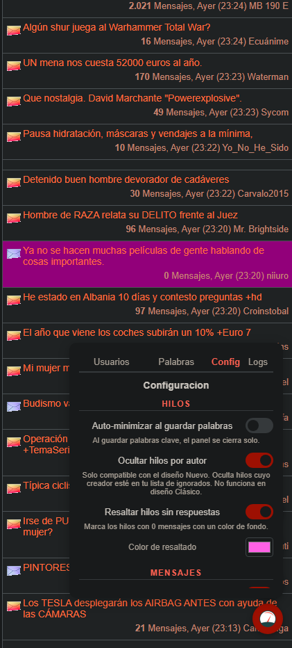
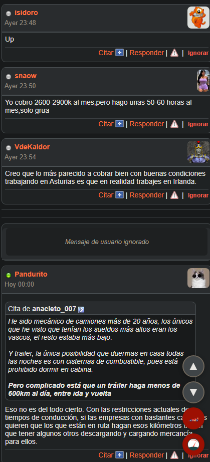
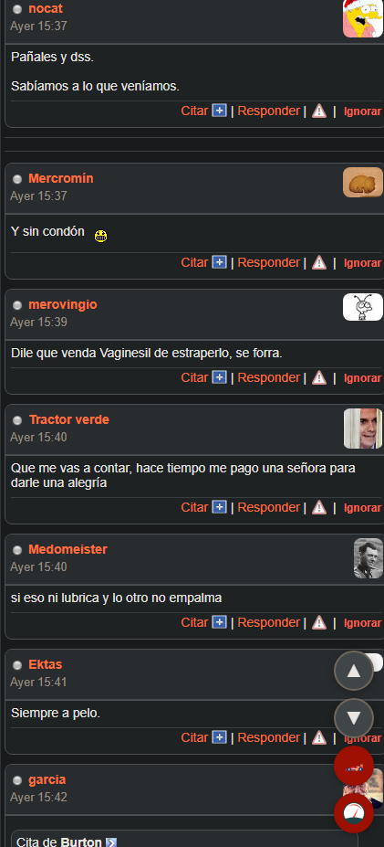
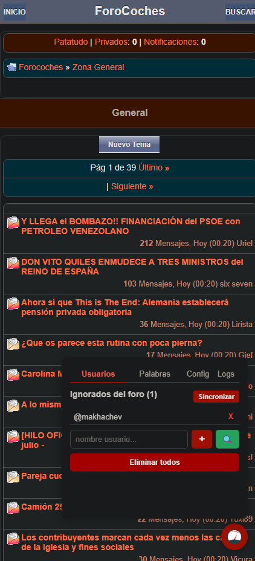
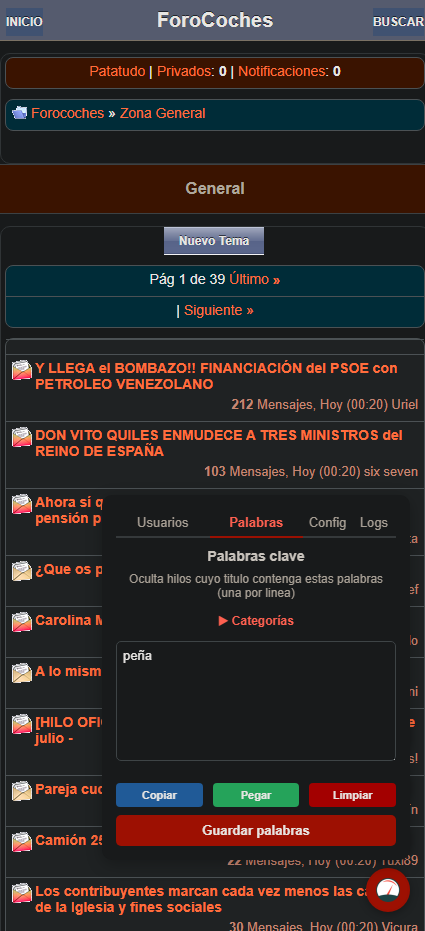
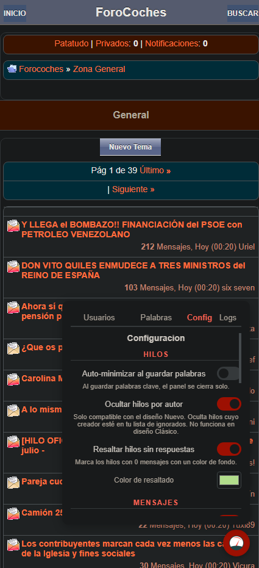
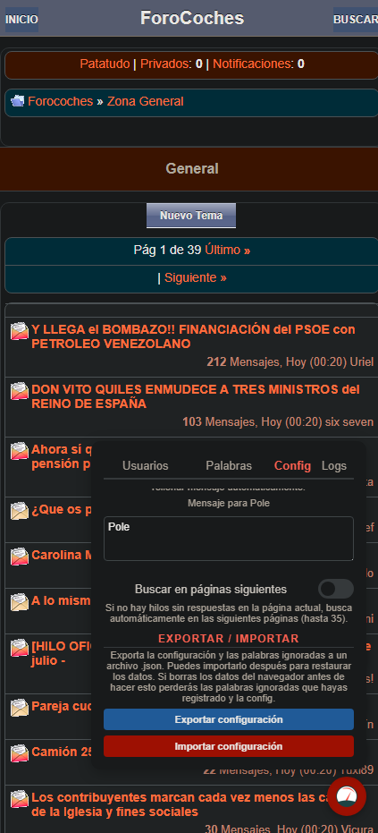

# Forocoches Premium 

[](https://github.com/Skjolberg/forocoches-premium)
[](https://github.com/Skjolberg/forocoches-premium/releases/latest)

**Userscript** que mejora Forocoches: Oculta hilos por usuarios ignorados y palabras clave, ignora mensajes de usuarios, poles automáticas, bloquea toda la publicidad, entre otras funciones. Compatible con **móvil y PC** (todos los diseños).

> **⚠️ Aviso importante:** Este proyecto es un proyecto **independiente y no oficial**. No está afiliado, asociado, autorizado, respaldado ni en modo alguno vinculado a Forocoches.com. Forocoches.com es una marca registrada de sus respectivos propietarios. Este proyecto no representa a Forocoches.com ni forma parte del mismo equipo, negocio o marca.

---

## ✨ Funcionalidades

### Ocultar hilos
- Por **palabras clave** en el titulo (sin acentos, insensitive)
- Por **autor** (solo diseño Nuevo, no Clásico)
- Muestra resumen de hilos ocultados con enlaces y motivo



### Resaltar hilos sin respuestas
- Marca los hilos con 0 mensajes con un color de fondo configurable (selector de color incluido)



### Ocultar mensajes
- Oculta mensajes de usuarios ignorados automaticamente
- Opcion de mostrar placeholder "Mensaje de usuario ignorado" en lugar de ocultar completamente
- Opcion de desactivar la ocultación de mensajes por completo



### Botones "Ignorar" en cada mensaje
- Se inyecta un enlace **Ignorar** junto a los botones "Citar", responder y denunciar.
- Añade al usuario a la lista local **y** a la lista de ignorados de Forocoches
- Oculta el post al instante



### Botón Pole (🏎️)
- Busca automaticamente el primer hilo sin respuestas en la pagina actual
- Si no encuentra, busca en paginas siguientes (hasta 35 paginas)
- Rellena el mensaje configurado y hace clic en Enviar
- Configurable desde el panel (mensaje a enviar, páginas siguientes)

### Panel flotante
- Acceso rapido desde cualquier pagina via boton circular (icono de FC)
- **4 pestañas**:
  - **Usuarios**: ver, anadir, eliminar, buscar por username, sincronizar con FC, eliminar todos
  - **Palabras**: editor de palabras clave + categorias predefinidas (Politica, Futbol, Anime, Videojuegos, Cripto, +18)
  - **Config**: varias opciones de configuracion + exportar/importar
  - **Logs**: registro de depuracion con botones Limpiar/Copiar




### Botones flotantes extra
- ▲ **Subir arriba** — scroll suave al inicio
- ▼ **Bajar abajo** — scroll a la caja de comentarios (o al final de pagina)
- Cada boton se oculta individualmente desde configuracion

### Eliminar publicidad y elementos molestos
- Bloquea **toda la publicidad** (optidigital, banners flotantes, skyscraper)
- Elimina avisos, noticias promocionadas y barra de cookies (`#infocookie`, `#vbnotices`)
- Elimina contenedores vacíos y placeholders de anuncios que distraen
- Elimina el botón nativo de "subir" para no duplicar funcionalidad
- Funciona en **todos los diseños**: móvil clásico, móvil nuevo, PC clásico y PC nuevo
- Configurable desde el panel (activar/desactivar por separado publicidad y avisos)

### Integracion con Forocoches real
- Sincroniza la lista de ignorados de FC
- Anade/elimina usuarios directamente

### Soporte multiplataforma
- **4 diseños** detectados automáticamente: móvil clásico, móvil nuevo, PC clásico y PC nuevo
- Adaptadores especificos para cada diseño (post containers, selectores, extraccion de datos)

### Exportar / Importar configuracion
- Exporta configuracion y listas de palabras a archivo JSON
- Importa desde JSON para restaurar datos




### Deteccion de navegacion
- History API monkey-patched (`pushState`/`replaceState`) + evento `popstate` para navegacion SPA
- MutationObserver para contenido dinamico (debounced a 150ms)
- Runs diferidos a 500ms (cambio de URL) y 1s (inicio)

---

## 📦 Instalacion

### En iOS Safari

iOS no soporta Tampermonkey directamente, pero puedes usar la extension **Userscripts**.<br>
Instala [Userscripts](https://apps.apple.com/es/app/userscripts/id1463298887) desde la App Store.<br>
Una vez instalado **Userscripts**, tienes 2 opciones para seguir con la instalación:
#### Opción 1 (automático)
1. Accede a este [`link`](https://update.greasyfork.org/scripts/584093/Forocoches%20Premium.user.js) desde tu navegador.
2. Desplazate a la parte superior izquierda de tu navegador y entra en `Userscripts`
3. Te pedirá permisos para instalar dicho script, simplemente permitelo.
4. `Userscripts` lo detectara automaticamente y hará el resto, asegurate que esté habilitado el Script.

#### Opción 2 (manual)
1. Abre la app **Archivos** o cualquier gestor y crea una carpeta llamada `Userscripts` (por ejemplo en iCloud Drive)
2. Abre la app Userscripts y configura la carpeta `Userscripts` como directorio de scripts
3. Descarga [`forocoches-premium.user.js`](https://github.com/Skjolberg/forocoches-premium/releases/latest/download/forocoches-premium.user.js) y guardalo en la anterior carpeta que has establecido como directorio para tus Scripts.
4. Una vez esté en la carpeta que has creado, Userscripts lo detectara automaticamente.

Entra a `https://forocoches.com/foro/` desde Safari y el script se ejecutara.

> 💡 **Tip**: Si tienes problemas, asegurate de que la extension Userscripts este **activada** en Safari.

### En Android

Android soporta Tampermonkey directamente en los navegadores compatibles.

#### Opción 1: Kiwi Browser (Chromium, recomendado)
1. Instala [Kiwi Browser](https://play.google.com/store/apps/details?id=com.kiwibrowser.browser) desde Google Play
2. Instala [Tampermonkey](https://chromewebstore.google.com/detail/tampermonkey/dhdgffkkebhmkfjojejmpbldmpobfkfo) desde Chrome Web Store
3. Abre este [`link`](https://update.greasyfork.org/scripts/584093/Forocoches%20Premium.user.js) y toca **Instalar**

#### Opción 2: Firefox Android
1. Instala [Firefox Nightly](https://play.google.com/store/apps/details?id=org.mozilla.fenix) desde Google Play
2. Instala [Tampermonkey](https://addons.mozilla.org/es/firefox/addon/tampermonkey/) desde Firefox Add-ons
3. Abre este [`link`](https://update.greasyfork.org/scripts/584093/Forocoches%20Premium.user.js) y toca **Instalar**

Entra a `https://forocoches.com/foro/` y el script se ejecutara

---

## ⚙️ Opciones de configuracion

| Opcion | Default | Descripcion |
|--------|---------|-------------|
| Auto-minimizar al añadir/eliminar usuarios | ✅ ON | Cierra el panel al modificar la lista |
| Auto-minimizar al guardar palabras | ❌ OFF | Cierra el panel al guardar palabras |
| Ocultar hilos por autor | ✅ ON | Oculta hilos cuyo creador este en tu lista (solo v2) |
| Resaltar hilos sin respuestas | ✅ ON | Marca hilos con 0 mensajes con color de fondo |
| Color de resaltado | #FFF3CD | Color de fondo para hilos sin respuestas |
| Mostrar placeholder al ocultar | ✅ ON | Muestra "Mensaje de usuario ignorado" en lugar de ocultar |
| Desactivar ocultación de mensajes | ❌ OFF | No oculta mensajes de ignorados |
| Redirigir al subforo al ignorar OP | ✅ ON | Vuelve al listado tras ignorar al OP |
| Recargar pagina al ignorar | ✅ ON | Recarga tras ignorar un usuario |
| Boton Subir arriba | ✅ ON | Muestra el boton ▲ |
| Boton Bajar abajo | ✅ ON | Muestra el boton ▼ |
| Botón Pole | ✅ ON | Muestra el boton 🏎️ para pole automatica |
| Mensaje para Pole | "Pole" | Texto a enviar en la pole (puedes poner incluso un gif o cualquier cosa) |
| Buscar en páginas siguientes | ✅ ON | Busca en paginas siguientes si no hay hilos sin respuestas (hasta 35) |
| Bloquear publicidad | ✅ ON | Elimina banners y anuncios (optidigital, flotantes, skyscraper) |
| Ocultar avisos | ✅ ON | Oculta mensajes de aviso, noticias promocionadas y cookies |

---

## 📝 Categorias predefinidas de palabras

| Categoria | Palabras incluidas |
|-----------|-------------------|
| **Politica** | politica, gobierno, pedro sanchez, pp, psoe, vox, elecciones, impuesto, corrupcion... |
| **Futbol** | futbol, real madrid, barcelona, champions, messi, vinicius, mbappe, penalty... |
| **Anime** | anime, naruto, one piece, dragon ball, attack on titan, death note, evangelion... |
| **Videojuegos** | videojuego, ps5, xbox, minecraft, fortnite, gta, elden ring, league of legends... |
| **Cripto** | bitcoin, ethereum, solana, nft, blockchain, defi, trading... |
| **+18** | +18, oslafo, osfo, nsfw, contenido sensible, sexo, porno... |
| **TODO** | Todas las categorias juntas |

---

## 🔧 Compilar desde codigo fuente

```bash
# Requisitos: Node.js >= 18
git clone <repo>
cd forocoches-premium
npm install
npm run build          # genera dist/forocoches-premium.user.js
npm run dev            # modo watch para desarrollo
```

### Stack tecnico

- TypeScript 5
- Vite 6
- vite-plugin-monkey
- esbuild
- Sin dependencias runtime (solo DOM APIs + localStorage)

---

## 📁 Estructura del proyecto

```
src/
├── main.ts           # Entry point: init, URL polling, deferred runs
├── runner.ts         # Deteccion de pagina y orquestacion
├── dom-adapter.ts    # Adapter pattern: theme detection + DOM ops
├── config.ts         # Getters/setters de configuracion
├── storage.ts        # Persistencia en localStorage
├── types.ts          # Interfaces TypeScript
├── threads.ts        # Parseo de DOM para extraer hilos
├── hide-threads.ts   # Ocultar hilos en forumdisplay
├── hide-posts.ts     # Ocultar posts + botones Ignorar
├── hide-ads.ts       # Bloqueo de publicidad y elementos molestos
├── ignore-fc.ts      # Integracion con FC (scrape + POST)
├── fc-api.ts         # Helpers para API de FC
├── observer.ts       # MutationObserver
├── toast.ts          # Notificaciones toast + logs
├── selectors.ts      # Selectores DOM
├── utils.ts          # Utilidades de texto
└── ui/
    ├── index.ts      # Orquestador: panel, botones, tabs
    ├── tab-users.ts  # Pestaña Usuarios
    ├── tab-words.ts  # Pestaña Palabras
    ├── tab-config.ts # Pestaña Config
    ├── tab-logs.ts   # Pestaña Logs
    ├── presets.ts    # Categorias predefinidas
    └── styles.ts     # Estilos CSS
```

---

## 📋 TODO

### Notas por usuario
- Poder añadir **notas personalizadas** a cada usuario desde:
  - El listado de un hilo (junto al nombre del autor)
  - El perfil del usuario (`member.php`)
- Las notas se guardan localmente en `localStorage` y se muestran al lado del username en los posts y al visitar su perfil
- Edición rápida: clic en la nota para modificar o eliminar

### Resaltar hilos por palabras y usuarios
- Listas independientes de ocultado para palabras y usuarios a resaltar
- Color de fondo configurable por tipo de resaltado (palabra, usuario, pole)
- Funciona en el listado de hilos (forumdisplay)

### Usuarios VIP
- Marcar usuarios como VIP desde el panel o desde sus posts
- Resaltar sus hilos en el listado con color propio
- Resaltar sus mensajes dentro de los hilos (showthread)
- Opción de no ocultar nunca hilos de VIPs aunque coincidan con filtros

### Resaltar mensajes del OP en showthread
- Color de fondo diferenciado para los posts del creador del hilo
- Identificación visual rápida del OP en discusiones largas

---

## 📄 Licencia

MIT

